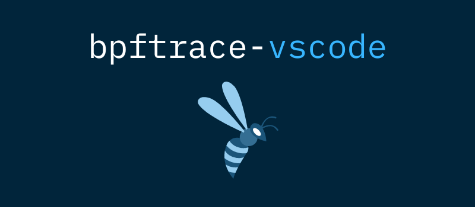

## bpftrace-vscode

We've released a new open source project today: [bpftrace-vscode](https://github.com/bpfdeploy-io/bpftrace-vscode), a VS Code plugin for [bpftrace](https://github.com/iovisor/bpftrace).

We've started off with syntax highlighting for now to aid developers in understanding their scripts a better bit, but we're ideating on other ways of leveraging the VS Code API. You can even use the plugin on the web version of VS Code!

In alignment with bpftrace, we've licensed this plugin under the Apache License, Version 2.0.

Happy kernel hacking!